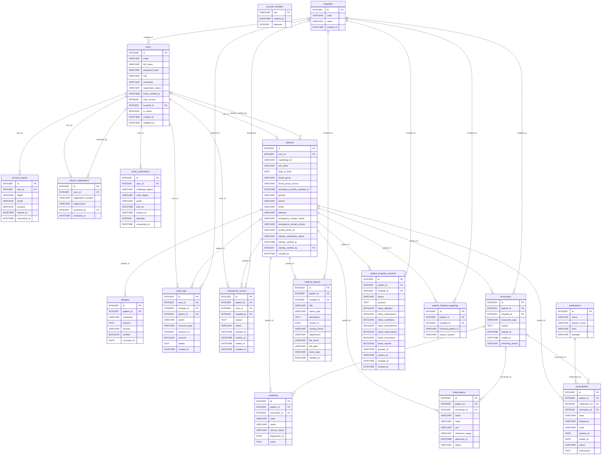

# Database design

Generated from SQLAlchemy metadata. Actual database creation and changes are governed by Alembic migrations.
This inventory describes the schema, not populated data.

## Entity relationship diagram

Relationship lines show foreign-key connections; nullable foreign keys and application-level constraints are listed below.

## account_throttles

| Column | Type | Nullable | References |
|---|---|---|---|
| `key` | VARCHAR(64) | No | - |
| `started_at` | DATETIME | No | - |
| `attempts` | INTEGER | No | - |

## account_tokens

| Column | Type | Nullable | References |
|---|---|---|---|
| `id` | INTEGER | No | - |
| `user_id` | INTEGER | No | users.id |
| `digest` | VARCHAR(64) | No | - |
| `portal` | VARCHAR(20) | No | - |
| `purpose` | VARCHAR(20) | No | - |
| `expires_at` | DATETIME | No | - |
| `consumed_at` | DATETIME | Yes | - |

## allergies

| Column | Type | Nullable | References |
|---|---|---|---|
| `id` | INTEGER | No | - |
| `patient_id` | INTEGER | No | patients.id |
| `substance` | VARCHAR(200) | No | - |
| `reaction` | TEXT | Yes | - |
| `severity` | VARCHAR(30) | Yes | - |
| `verified` | BOOLEAN | No | - |
| `recorded_on` | DATE | Yes | - |

## audit_logs

| Column | Type | Nullable | References |
|---|---|---|---|
| `id` | INTEGER | No | - |
| `user_id` | INTEGER | Yes | users.id |
| `hospital_id` | INTEGER | Yes | hospitals.id |
| `patient_id` | INTEGER | Yes | patients.id |
| `action` | VARCHAR(100) | No | - |
| `resource_type` | VARCHAR(50) | No | - |
| `resource_id` | INTEGER | Yes | - |
| `success` | BOOLEAN | No | - |
| `details` | TEXT | Yes | - |
| `created_at` | DATETIME | No | - |

## conditions

| Column | Type | Nullable | References |
|---|---|---|---|
| `id` | INTEGER | No | - |
| `patient_id` | INTEGER | No | patients.id |
| `encounter_id` | INTEGER | Yes | encounters.id |
| `code` | VARCHAR(50) | Yes | - |
| `name` | VARCHAR(200) | No | - |
| `clinical_status` | VARCHAR(50) | No | - |
| `diagnosed_on` | DATE | Yes | - |
| `notes` | TEXT | Yes | - |

## doctor_registrations

| Column | Type | Nullable | References |
|---|---|---|---|
| `id` | INTEGER | No | - |
| `user_id` | INTEGER | No | users.id |
| `registration_number` | VARCHAR(100) | No | - |
| `organization` | VARCHAR(200) | No | - |
| `reviewed_by` | INTEGER | Yes | users.id |
| `reviewed_at` | DATETIME | Yes | - |

## email_verifications

| Column | Type | Nullable | References |
|---|---|---|---|
| `id` | INTEGER | No | - |
| `user_id` | INTEGER | No | users.id |
| `challenge_digest` | VARCHAR(64) | No | - |
| `code_digest` | VARCHAR(64) | No | - |
| `portal` | VARCHAR(20) | No | - |
| `sent_at` | DATETIME | No | - |
| `expires_at` | DATETIME | No | - |
| `attempts` | INTEGER | No | - |
| `consumed_at` | DATETIME | Yes | - |

## emergency_access

| Column | Type | Nullable | References |
|---|---|---|---|
| `id` | INTEGER | No | - |
| `patient_id` | INTEGER | No | patients.id |
| `user_id` | INTEGER | No | users.id |
| `hospital_id` | INTEGER | No | hospitals.id |
| `reason` | TEXT | No | - |
| `status` | VARCHAR(20) | No | - |
| `granted_at` | DATETIME | No | - |
| `expires_at` | DATETIME | No | - |
| `ended_at` | DATETIME | Yes | - |
| `created_at` | DATETIME | No | - |

## encounters

| Column | Type | Nullable | References |
|---|---|---|---|
| `id` | INTEGER | No | - |
| `patient_id` | INTEGER | No | patients.id |
| `hospital_id` | INTEGER | No | hospitals.id |
| `encounter_type` | VARCHAR(50) | No | - |
| `reason` | TEXT | Yes | - |
| `started_at` | DATETIME | No | - |
| `ended_at` | DATETIME | Yes | - |
| `attending_doctor` | VARCHAR(200) | Yes | - |

## hospitals

| Column | Type | Nullable | References |
|---|---|---|---|
| `id` | INTEGER | No | - |
| `code` | VARCHAR(32) | No | - |
| `name` | VARCHAR(200) | No | - |
| `created_at` | DATETIME | No | - |

## medical_reports

| Column | Type | Nullable | References |
|---|---|---|---|
| `id` | INTEGER | No | - |
| `patient_id` | INTEGER | No | patients.id |
| `hospital_id` | INTEGER | No | hospitals.id |
| `title` | VARCHAR(200) | No | - |
| `report_type` | VARCHAR(100) | No | - |
| `description` | TEXT | Yes | - |
| `issued_on` | DATE | No | - |
| `issuing_doctor` | VARCHAR(200) | Yes | - |
| `department` | VARCHAR(200) | Yes | - |
| `file_name` | VARCHAR(255) | No | - |
| `file_path` | VARCHAR(500) | No | - |
| `mime_type` | VARCHAR(100) | No | - |
| `created_at` | DATETIME | No | - |

## medications

| Column | Type | Nullable | References |
|---|---|---|---|
| `id` | INTEGER | No | - |
| `name` | VARCHAR(200) | No | - |
| `generic_name` | VARCHAR(200) | Yes | - |
| `form` | VARCHAR(100) | Yes | - |
| `strength` | VARCHAR(100) | Yes | - |

## observations

| Column | Type | Nullable | References |
|---|---|---|---|
| `id` | INTEGER | No | - |
| `patient_id` | INTEGER | No | patients.id |
| `encounter_id` | INTEGER | Yes | encounters.id |
| `name` | VARCHAR(200) | No | - |
| `value` | VARCHAR(200) | No | - |
| `unit` | VARCHAR(50) | Yes | - |
| `reference_range` | VARCHAR(100) | Yes | - |
| `observed_at` | DATETIME | No | - |
| `status` | VARCHAR(30) | No | - |

## patient_hospital_consents

| Column | Type | Nullable | References |
|---|---|---|---|
| `id` | INTEGER | No | - |
| `patient_id` | INTEGER | No | patients.id |
| `hospital_id` | INTEGER | No | hospitals.id |
| `status` | VARCHAR(20) | No | - |
| `purpose` | TEXT | No | - |
| `share_allergies` | BOOLEAN | No | - |
| `share_medications` | BOOLEAN | No | - |
| `share_conditions` | BOOLEAN | No | - |
| `share_prescriptions` | BOOLEAN | No | - |
| `share_observations` | BOOLEAN | No | - |
| `share_encounters` | BOOLEAN | No | - |
| `share_reports` | BOOLEAN | No | - |
| `granted_at` | DATETIME | No | - |
| `expires_at` | DATETIME | Yes | - |
| `revoked_at` | DATETIME | Yes | - |
| `created_at` | DATETIME | No | - |

## patient_hospital_mappings

| Column | Type | Nullable | References |
|---|---|---|---|
| `id` | INTEGER | No | - |
| `patient_id` | INTEGER | No | patients.id |
| `hospital_id` | INTEGER | No | hospitals.id |
| `external_patient_id` | VARCHAR(100) | No | - |
| `source_system` | VARCHAR(100) | Yes | - |

## patients

| Column | Type | Nullable | References |
|---|---|---|---|
| `id` | INTEGER | No | - |
| `user_id` | INTEGER | Yes | users.id |
| `medbridge_id` | VARCHAR(64) | No | - |
| `full_name` | VARCHAR(200) | No | - |
| `date_of_birth` | DATE | Yes | - |
| `blood_group` | VARCHAR(8) | Yes | - |
| `blood_group_source` | VARCHAR(30) | Yes | - |
| `emergency_details_updated_at` | DATETIME | Yes | - |
| `gender` | VARCHAR(30) | Yes | - |
| `phone` | VARCHAR(30) | Yes | - |
| `email` | VARCHAR(255) | Yes | - |
| `address` | VARCHAR(500) | Yes | - |
| `emergency_contact_name` | VARCHAR(200) | Yes | - |
| `emergency_contact_phone` | VARCHAR(30) | Yes | - |
| `profile_photo_url` | VARCHAR(500) | Yes | - |
| `identity_verification_status` | VARCHAR(30) | Yes | - |
| `identity_verified_at` | DATETIME | Yes | - |
| `identity_verified_by` | INTEGER | Yes | users.id |
| `created_at` | DATETIME | No | - |

## prescriptions

| Column | Type | Nullable | References |
|---|---|---|---|
| `id` | INTEGER | No | - |
| `patient_id` | INTEGER | No | patients.id |
| `medication_id` | INTEGER | No | medications.id |
| `encounter_id` | INTEGER | Yes | encounters.id |
| `dose` | VARCHAR(100) | Yes | - |
| `frequency` | VARCHAR(100) | Yes | - |
| `route` | VARCHAR(50) | Yes | - |
| `started_on` | DATE | Yes | - |
| `ended_on` | DATE | Yes | - |
| `status` | VARCHAR(30) | No | - |
| `instructions` | TEXT | Yes | - |

## users

| Column | Type | Nullable | References |
|---|---|---|---|
| `id` | INTEGER | No | - |
| `email` | VARCHAR(255) | No | - |
| `full_name` | VARCHAR(200) | No | - |
| `password_hash` | VARCHAR(255) | No | - |
| `role` | VARCHAR(50) | No | - |
| `username` | VARCHAR(60) | Yes | - |
| `registration_status` | VARCHAR(30) | No | - |
| `email_verified_at` | DATETIME | Yes | - |
| `auth_version` | INTEGER | No | - |
| `hospital_id` | INTEGER | Yes | hospitals.id |
| `is_active` | BOOLEAN | No | - |
| `created_at` | DATETIME | No | - |
| `updated_at` | DATETIME | No | - |
