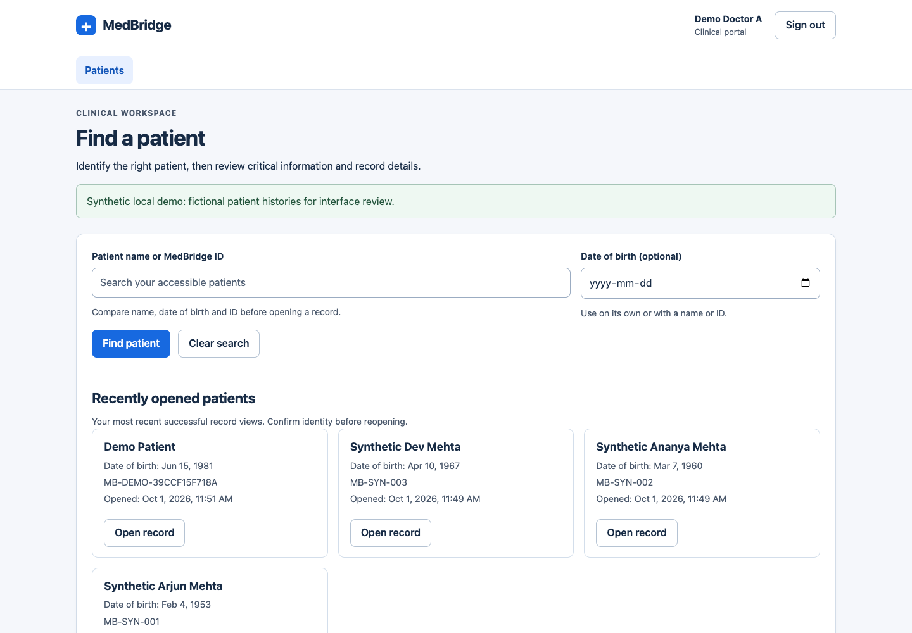
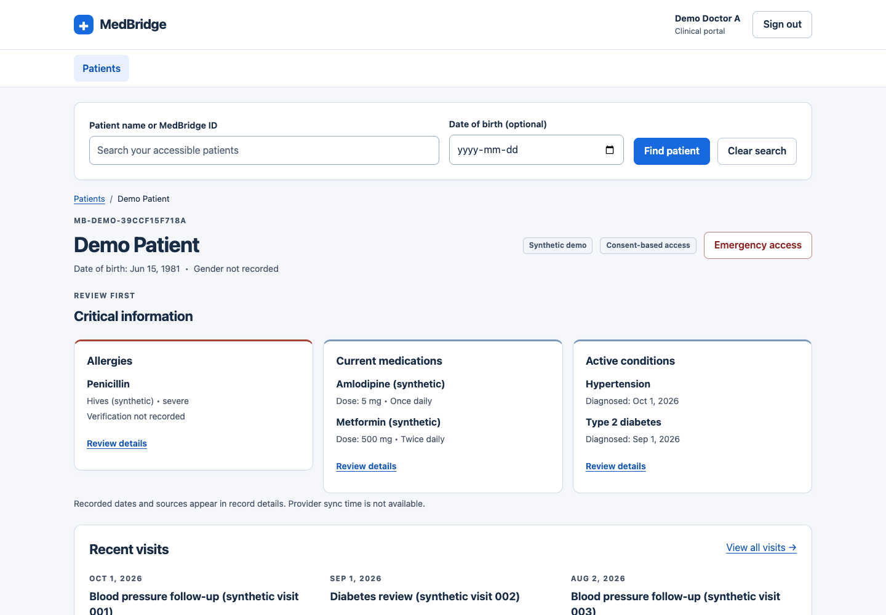
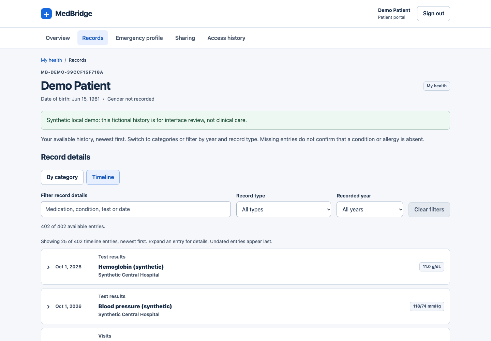
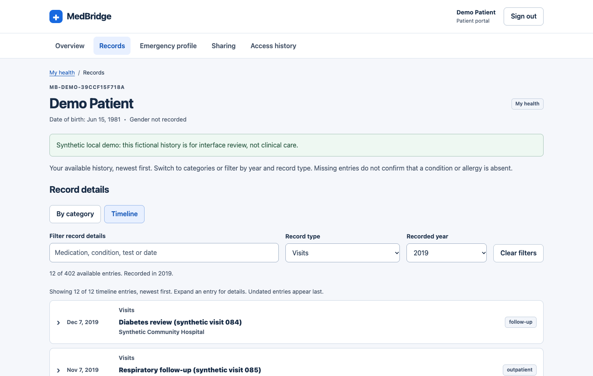
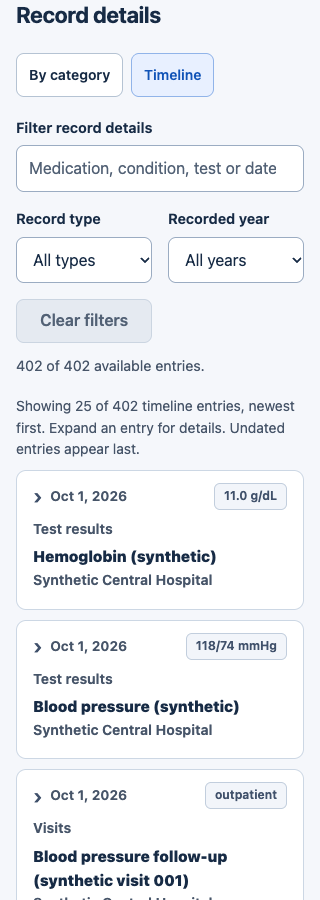

# Populated doctor and patient UX review

The local app at http://localhost:5173 now contains 100 fictional patient profiles. This replaces the earlier empty clinical database at the user's request. The existing doctor and patient account credentials are preserved.

## Doctor review

- Name/MedBridge ID and optional date of birth are visible on the landing page and while reviewing a record. DOB works alone or together with the identity query.
- Recently opened patients come from this account's successful record-view audit events, ordered by the latest view. Repeated views appear once. Profiles without a current hospital connection are excluded. Opening a record still checks clinical consent separately.
- The directory displays 10 patients per page, with explicit previous/next controls and range counts. Search uses the full accessible directory, not just the visible page.
- Each record keeps allergies, current medications and active conditions ahead of detailed history. A three-visit preview links to the full visit list. Repeated jump links reset filters and reveal the requested category.
- Patient searches do not replace the current record until an identity is explicitly opened. Search results retain date of birth and MedBridge ID for comparison.





## Patient review

Sign in with the existing demo patient account, then open **Records**. Its history contains 402 clinical entries from December 2018 through October 2026, including 96 visits, 96 prescriptions, 192 test results, 17 conditions and one allergy.

- Records open as a dated timeline, newest first. Each compact row shows the category, title, recorded source and applicable status or result; expand it for the full details.
- Initially display 25 timeline entries, then reveal 25 older entries at a time. Category lists initially display 10 entries and reveal 10 more at a time.
- Search, record type and recorded year work together. Clearing filters restores the full available history. Changing filters resets the disclosure count.
- Overview includes the latest three visits and retains current health information and sharing links.







## Synthetic dataset

| Item | Count |
| --- | ---: |
| Patient profiles, including the existing demo patient | 100 |
| Synthetic hospitals | 3 |
| Encounters | 3,637 |
| Conditions | 747 |
| Allergies | 199 |
| Prescriptions | 3,637 |
| Test results | 7,274 |

The additional 99 profiles use names prefixed with **Synthetic**, MedBridge IDs `MB-SYN-001` through `MB-SYN-099`, and reserved `example.com` email addresses. These are profiles, not 99 additional sign-in accounts. Each has all five clinical categories, with different birth dates and histories. Their histories have 12 to 60 visits; the existing demo patient has 96. Synthetic hospital/source labels and a demo notice distinguish the data from real clinical information. Medication examples are fictional UI fixtures and are not treatment guidance.

The demo doctor is assigned to Synthetic Central Hospital. All 100 profiles have mappings to three synthetic hospitals and explicitly labeled simulation sharing grants. The seed does not create fictional audit activity. The recent list and access history contain actual local verification views.

`backend/scripts/seed_synthetic.py` provides an explicit, transactional, idempotent seed. Its CLI requires `--local-demo`, a development environment and a local database URL. It preserves credentials, rejects replacing an existing non-demo clinical history or hospital assignment, and does not reapply grants or overwrite edited records on repeated runs. Nothing seeds automatically during server startup or migrations.

From `backend`, after provisioning the explicitly named local demo accounts and configuring a local development database:

```sh
python -m scripts.seed_synthetic --local-demo
```

The current workspace used `.local/populate-demo.py`, which saved a PostgreSQL backup before the first write. The backup, account secrets, runtime configuration and database files remain outside the cloned repository. The script and review screenshots are suitable for the pull request; database contents are local only.

## Verification and limits

- Full backend suite: **82 passed**. Tests cover recent-list ownership, successful-view filtering, deduplication, ordering, hospital visibility, DOB-only/combined search, local seed guards, 100-profile coverage, long-history dates, account preservation and idempotence, alongside the earlier consent and emergency tests. Existing dependency deprecation warnings remain.
- Frontend lint and production build passed.
- Browser checks verified a 100-profile directory, next-page navigation, DOB-only lookup, persisted recent records, 20-of-96 doctor visit disclosure, year filtering without hiding critical information, repeated category jump links, 25-to-50 patient timeline disclosure, descending date order, keyboard expansion and 2019 visit filtering/category disclosure.
- Doctor records and the compact patient timeline reflow at 320px without horizontal overflow.
- Axe scans for the populated desktop directory, doctor record and patient timeline, plus the 320px patient timeline, returned zero violations and zero incomplete checks for the tested WCAG tags. Scans and screenshots are available in `ux-populated/`. Automated scans do not establish full accessibility compliance. Screen-reader and native browser zoom testing remain manual checks.

The UI limits rendered history rows, but the current API still loads the full available record. Larger production histories need API pagination or a dedicated timeline endpoint. This dataset supports a populated UX review, not a production scalability benchmark or a usability study.

AI summaries, clinically reviewed medication safety rules and a general document feed remain separate backend integrations, as described in [UX-IMPLEMENTATION.md](UX-IMPLEMENTATION.md).
