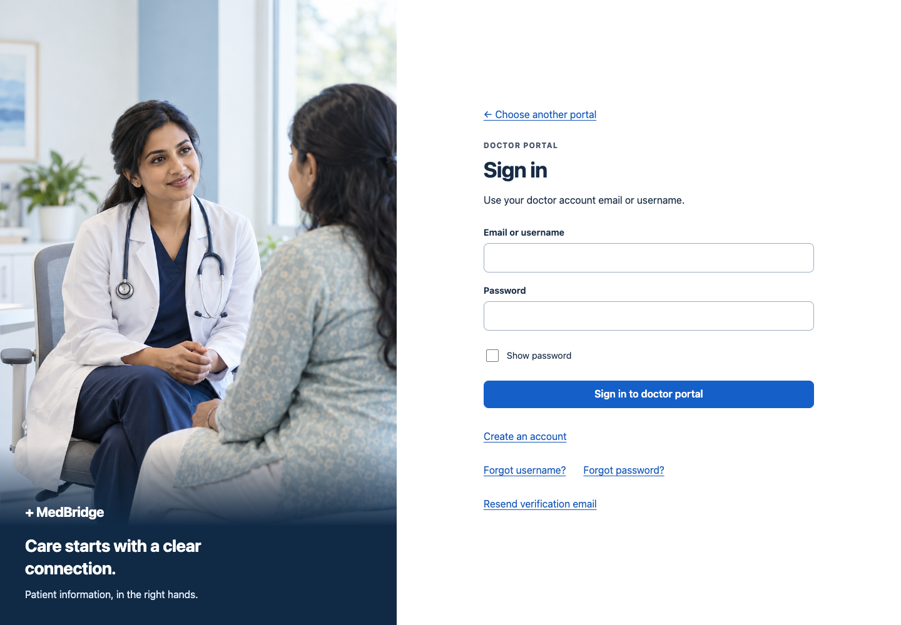
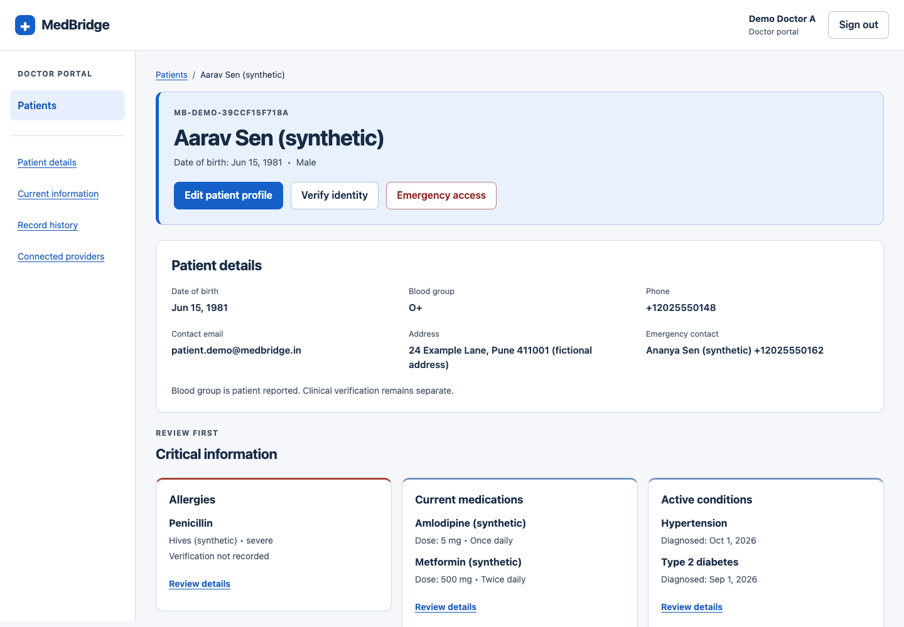
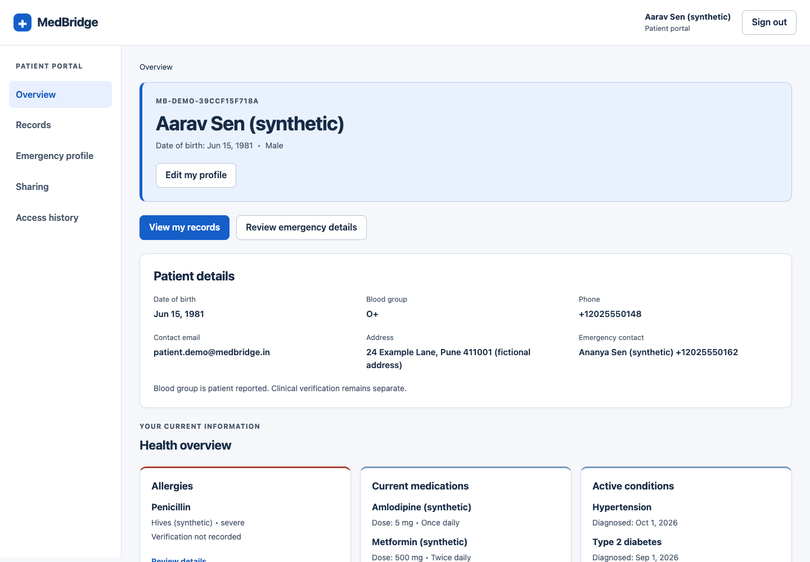

# Separate portals and patient-first layouts

This revision implements the requested changes locally. It preserves the supplied sign-in credentials and the 100 populated profiles. Doctor registrations require administrator approval. Verification and recovery messages are captured in a private local mailbox; no external email is sent.

## Review the local app

- Welcome: http://localhost:5173/
- Doctor sign in: http://localhost:5173/doctor/sign-in
- Patient sign in: http://localhost:5173/patient/sign-in
- Signup and recovery links appear in each portal's entry flow.

The existing patient account now displays **Aarav Sen (synthetic)**. Contact information is fictional, including the example address and reserved 555 telephone numbers. Its existing 96 visits and 402 clinical entries remain intact. Directory and patient-selection controls sort by name, with `(synthetic)` at the end. Recently opened patients retain chronological order because they represent actual local record-view activity.

## Structural changes

| Scenario | Before | Now |
| --- | --- | --- |
| Doctor finds a patient | Shared login; submit search and scan cards; search remains above an open record | Separate doctor login; prominent name/ID field with matching dropdown and visible DOB; compare name, DOB and ID; explicitly select a match; enter focused patient context |
| Doctor manages a profile | Profile, photo and account controls below clinical history | Edit profile and create account at the top of doctor home; patient selection before management; edit profile at the top of the selected record; optional photo upload within editing |
| Patient reviews their information | Demo identity; profile behind an accordion; horizontal navigation | Named synthetic identity panel; top edit action; visible demographic/contact details; left navigation for Overview, Records, Emergency profile, Sharing and Access history |
| Patient scans a long history | Medication category expands full detail rows and pushes other information down | One category open at a time; compact dated entries expand individually; 10 entries per category or 25 per timeline batch; type, year and text filters work together |
| Account help | Contact administrator as the only option | Separate username recovery, password reset and verification resend; clear missing/expired/used-link paths and administrator help when email access is lost |

The left navigation stays available on desktop. Narrow screens use wrapping navigation above the content. The selected doctor's record includes direct section links for patient details, current information, history and providers. Search and unrelated patients disappear until the clinician returns to the directory. Redundant My health, synthetic-demo and access-mode badges are removed; clinically relevant severity, result and medication-status labels remain.

### Patient record layout

```text
Left navigation                 Main patient context
Patients                        Breadcrumb: Patients / patient name
Patient details                 NAME, date of birth, patient ID
Current information             Edit profile | Verify identity | Emergency access
Record history                  Visible patient details and contact information
Connected providers             Allergies | Current medications | Active conditions
                                Recent visits
                                Category or timeline history with filters
                                Connected providers
```

## Account rules and scenarios

1. **Separate entry:** `/auth/doctor/login` accepts doctor and administrator roles; `/auth/patient/login` accepts patient roles. The server reads the stored role. The former `/auth/login` endpoint is removed. A password valid for the other portal does not grant access. Existing sessions still undergo server-side role, active-account and session-version checks.
2. **Doctor signup:** creates an inactive doctor without hospital access. Email verification moves it to `pending_approval`. Administrators review professional credentials and organization membership, then assign a hospital. Hospital administrators can approve matching-organization applications only for their own hospital. System administrators can review all applications and choose a verified hospital. Approval records the reviewer and hospital assignment. An ordinary doctor cannot approve registrations.
3. **Patient signup:** creates a separate empty, unverified patient profile. Email verification enables its sign-in. Signup never claims another patient's clinical history using email or date of birth. Connecting existing records remains an authorized provider identity-resolution process.
4. **Username recovery:** sends the username, or the email identifier for older accounts without usernames, privately to the registered address. The public response is the same for unknown emails and wrong-portal accounts. Losing both the identifier and email access requires administrator identity checks.
5. **Password recovery:** portal-bound reset links expire after 30 minutes, work once, and are stored as hashes. A successful reset invalidates other reset links and previous access-token versions. Resetting a password does not activate an unapproved doctor. There is no automatic login after resetting.
6. **Email verification:** links expire after 24 hours. The resend flow supports unverified registrations. Verification does not replace professional review or patient identity verification.
7. **Feedback and input:** forms retain input after errors, detect mismatched passwords, permit password-manager paste, and report pending approval, loading and successful actions. Email/username comparisons tolerate case and surrounding whitespace. Phone inputs accept spaces, parentheses and hyphens; blood-group input is normalized. Native date controls support date selection and reject future birth dates.
8. **Profile ownership:** patient edits target their authenticated profile. Contact email edits do not change account email. Blood-group changes retain patient-reported versus clinician-entered provenance. Photo uploads are bounded to 5 MB and checked for supported type and signature; editing cannot set arbitrary photo URLs or verification metadata.

Sign-in failures and account-email requests are limited per client, portal and identifier over a 15-minute window. Successful active-account sign-ins reset the failure counter. These controls and the local tests are prototype safeguards, not a formal security assessment.

## Local setup and deployment boundary

Apply additive migration `b82a15c30102` before starting the updated backend:

```sh
cd backend
alembic upgrade head
```

Account capture requires these backend environment settings. Keep the mailbox outside any public/static directory and outside Git:

```dotenv
APP_ENV=development
ACCOUNT_MAIL_MODE=capture
ACCOUNT_MAILBOX_DIR=/absolute/private/path/to/mailbox
PUBLIC_APP_URL=http://localhost:5173
```

The current workspace runner uses `../.local/mailbox`. Each message is a permission-restricted JSON file containing recipient, subject and body. Open its localhost link in the matching portal to test verification or reset. These files contain private, usable links and are not committed. Capture is refused outside development or with a non-localhost application origin. Without configured account email delivery, signup/recovery return a clear service-unavailable message.

No production email provider or backend deployment is included. Frontend previews need the updated API and migration to exercise the new auth flows. Deploy frontend and backend together when that later release is approved. The server and local PostgreSQL data remain running independently of the tool session. A database backup was saved before the migration and name updates.

## Three useful references

- [W3C matching-results combobox](https://www.w3.org/WAI/ARIA/apg/patterns/combobox/examples/combobox-autocomplete-list/): manual selection, keyboard movement, active-option feedback and keeping the focused suggestion visible. Applied to doctor patient search, with name, DOB and ID in every option. Assistive-technology testing is still needed before a production accessibility claim.
- [MyChart account recovery](https://www.mychart.org/l/en-us/help/forgot-password/): distinguish username and password recovery, with a help-desk route when self-service fails. Applied to both entry flows without revealing recovery details publicly.
- [NHS account entry](https://www.nhs.uk/nhs-app/account/): make account entry and creation visible as clear choices. Applied to welcome and portal entry screens.

## Image provenance

`frontend/public/images/account-care.png` was generated using the built-in image generation tool for this request. It shows fictional people and does not depict MedBridge staff or a real clinical service. It is decorative in the interface and has empty alternative text.

Prompt: “Create a polished photographic image for the left side of a healthcare web application's login and signup screens. Portrait orientation 2:3. A fictional South Asian female physician in her 30s wearing a simple white coat over muted navy clothing sits facing a fictional South Asian adult patient in a bright contemporary consultation room. Warm, calm, respectful conversation, no medical procedure. Natural daylight, soft blue and off-white palette, uncluttered background, authentic human expressions, editorial healthcare photography. People centered in the upper middle with generous breathing room; compose for a tall sidebar crop. No text, no logos, no interface elements, no watermarks. This image depicts fictional people, not an actual care team.”

## Validation

Validation results and screenshots are recorded in [the evidence notes](portal-revision/VERIFICATION.md). Earlier implementation screenshots in `ux-verification` and `ux-populated` are historical stages; the `portal-revision/evidence` captures represent this revision.






