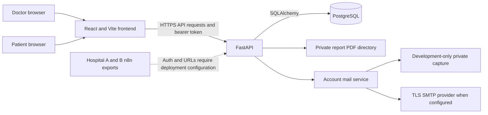

# System architecture

`frontend/src/lib.js` selects the API base URL and handles authenticated requests, timeouts and errors. `App.jsx` selects portal routes. Patient navigation includes a separate Medical Reports page. Doctor reports are a separate record section and remain visible when history changes layout.

`backend/app/main.py` registers each API router once. CORS origins come from configuration. Authentication uses signed, one-hour JWTs and active database accounts. Authorization and consent are evaluated by backend dependencies and endpoint handlers, not by hiding UI elements.

Account verification/reset state lives in PostgreSQL. Delivery occurs after the user/token transaction commits. Capture and SMTP share the same email content and portal-specific link generation. SMTP is synchronous with a bounded socket timeout; there is no background queue, delivery webhook, bounce processor or durable retry worker.

Reports are listed from `medical_reports` rows. Files are resolved inside `backend/app/demo_reports` and returned only after authorization. This is prototype file storage, not a general report upload pipeline. Profile photographs use `/uploads`, which is a separate public static mount.

[Database/ER diagram](DATABASE-DESIGN.md) and [API inventory](API-DOCUMENTATION.md) are generated from the final code. Deployment pairing, storage persistence and live email require the checks in [deployment](DEPLOYMENT.md).
