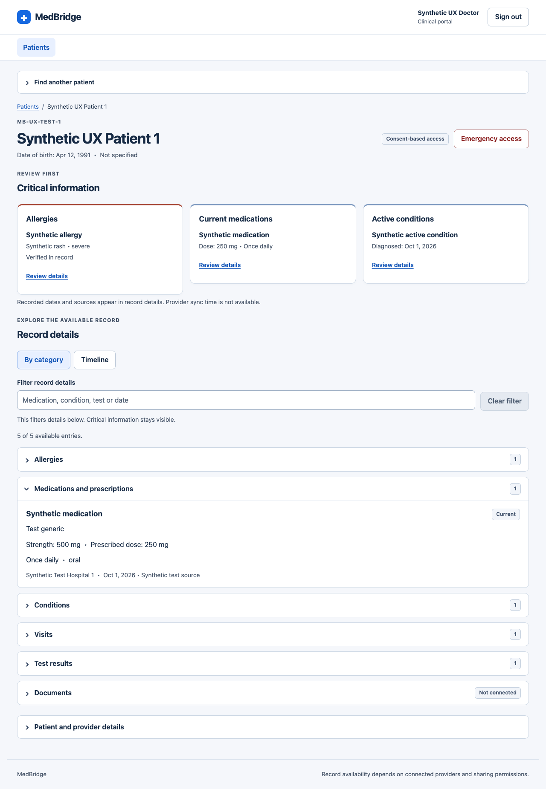
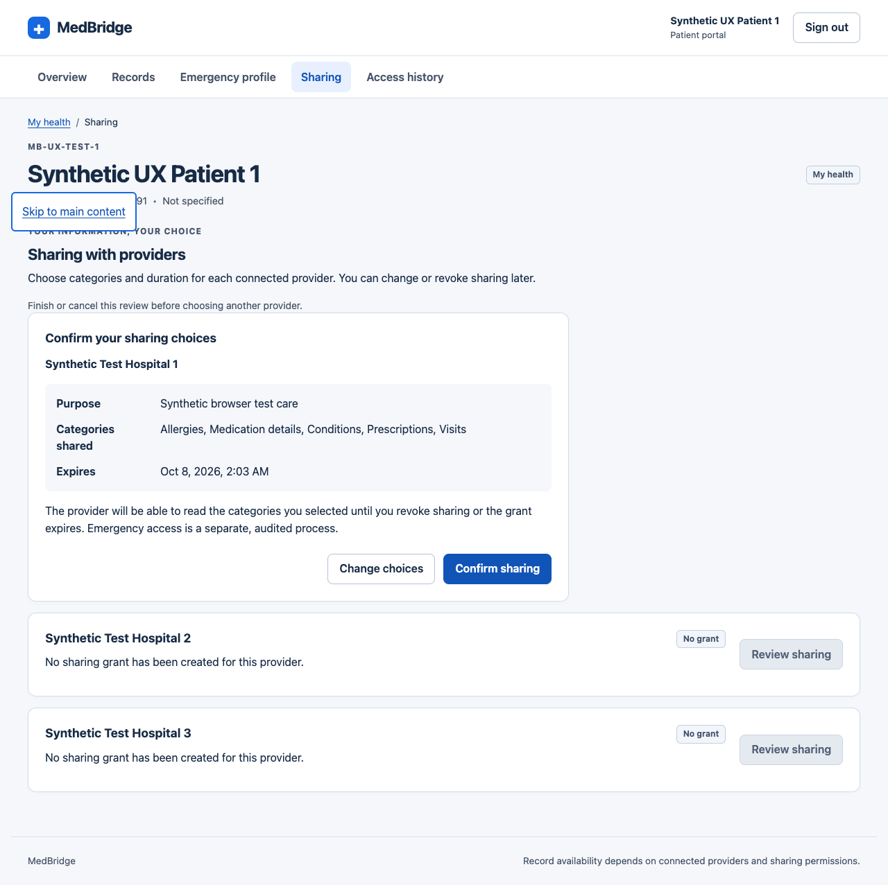

# MedBridge local UX implementation

Implemented on the local `codex/medbridge-ux-improvements` branch. No remote push or deployment was performed.

## Completed stages

1. **Session and navigation.** Restore the authenticated account before selecting a portal. Preserve role and page on reload; support browser Back and direct URLs. Keep account controls visible during loading and errors. Clear expired sessions with an explicit sign-in message. Add a shared sign-in screen for both roles.
2. **Doctor workflow.** Search accessible patients by name or MedBridge ID, optionally with date of birth. Compare identity before opening a record. Keep a selected record while searching for another patient. Put identity, consent state and allergies/current medications/active conditions first. Separate record filtering from critical information; show matched/total counts and a clear action. Add categories and a dated timeline. Disclose demographic/provider administration separately and retain profile editing, photos, account creation and identity verification.
3. **Patient workflow.** Add Overview, Records, Emergency profile, Sharing and Access history pages. Expose visits and test results alongside clinical categories. Distinguish medication strength from prescribed dose. Explain missing information without implying clinical absence. Keep emergency-editor values after failure; normalize accepted phone formats and update the canonical displayed profile after save.
4. **Sharing and transparency.** Review provider, purpose, explicit categories and duration before confirmation. Edit existing choices without resetting their scope. Keep a single emphasized action in the active review and prevent another provider from replacing unfinished choices. Compute expiry accurately; confirm revocation and retain controls after failure. Enforce scopes on unified and FHIR clinical reads. Show normal record views, emergency sessions and patient changes in patient-owned history, with time-zone context, category filters and cursor pagination.
5. **Emergency access.** Name the patient in the rationale dialog. Restore active sessions from the backend, retain them after profile-fetch/end failures and make termination available. Keep emergency access separate from normal record browsing. Remove expired clinical content from the screen. Support initial focus, keyboard containment, Escape and focus return.
6. **Shared design system.** Use consistent controls, spacing, status messages and empty states. Desktop gutters are 24px, mobile gutters 16px, cards 16 to 24px, and primary controls at least 44px high. Improve text contrast, visible focus, labels, error associations, live feedback, reduced-motion behavior and narrow-screen wrapping.

## Visual examples

The following screens use the isolated synthetic dataset.

## Backend changes

- Add blood-group provenance and emergency-details update time through additive migration `a73d91e5b204`.
- Distinguish patient-reported and clinician-entered blood groups from clinical verification. Existing values keep unknown provenance.
- Supply actual provider names where the stored relationships support them. Unlinked allergy provenance remains explicitly unknown.
- Return consent access mode, expiry and withheld categories without disclosing hidden records.
- Add patient-owned sharing updates, effective expiry handling, sharing audit events, normal/FHIR view visibility and history pagination.
- Add active emergency-session restoration and prescription dose/frequency/route to the restricted profile.
- Normalize sign-in email casing without changing password bytes.
- Add frontend route rewrites for a future Vercel deployment. Hosting remains unchanged; verify those rewrites against the project’s selected frontend root before publishing.

## Verification

- **78 backend tests passed**, including new tests for partial sharing, FHIR enforcement, expiry/re-grant, ownership, emergency normalization/provenance, clinician-entered provenance, history pagination/isolation, and session restoration/termination. Existing dependency deprecation warnings remain.
- Frontend **lint and production build passed**.
- Automated axe scans on sign-in, populated doctor record, patient overview, patient records, sharing review and access history returned **zero violations and zero incomplete checks** for the tested WCAG tags. These scans do not establish full accessibility compliance.
- Browser checks covered explicit first-grant review, preserved sharing choices, revocation failure/retry, normal and emergency history, patient Back/reload, invalid-session recovery, record filtering and timeline disclosure.
- Keyboard checks verified emergency-dialog initial focus on the reason, Tab/Shift+Tab wrapping, Escape and return to the initiating control.
- Simulated network failures retained emergency reasons, granted sessions, end controls and patient emergency-form values. Retry saved and displayed normalized contact values.
- Doctor records, patient records and patient history reflowed at **320px without horizontal overflow**. Doctor records also passed a **200% CSS magnification** check. Native browser zoom and screen-reader testing remain manual follow-up checks.
- Both original local accounts were checked against the normal local API. No hospital assignments, clinical records or sharing grants were seeded into that database.

Screenshots and structured checks are in [ux-verification](ux-verification/). Populated screenshots use clearly named synthetic patients in a disposable test database, not your local patient account.

## Run and review locally

Normal app: http://localhost:5173

Local API: http://127.0.0.1:8001/docs

The workspace `.local/start-backend.sh` applies migrations and starts the existing local PostgreSQL-backed API. `.local/start-frontend.sh` starts Vite. These environment helpers and credentials are outside the cloned repository.

For repository validation, run `npm run lint` and `npm run build` from `frontend`. Run `pytest` from `backend` with a test-only `DATABASE_URL=sqlite://` and a test-only `JWT_SECRET_KEY` of at least 32 characters. The tests override database access with isolated fixtures.

For populated browser verification, run `python -m tests.run_ux_fixture_server` from `backend`. It creates synthetic data in a temporary SQLite directory on port 8002, including an explicit test-only consent. Start a separate Vite instance on port 5174 with `VITE_API_BASE_URL=http://127.0.0.1:8002`. Its doctor/patient test account identifiers are defined in `tests/ux_fixtures.py`. The temporary data is discarded when that server exits.

## Integrations still outside the working prototype

AI-generated clinical summaries, validated medication interaction/allergy safety rules and a general patient document feed are not implemented backend features. They need provider/catalog decisions, source-linking and clinical review requirements, and document storage/access contracts. The interface preserves the existing two public synthetic reports for their original demonstration patient and clearly labels other document sources as unconnected.

Source synchronization timestamps and complete per-allergy provider provenance are absent from the existing data model. The UI shows that information as unavailable instead of inventing freshness or origins. External hospital workflows were not started or altered. No usability study was conducted, so improvements in task completion or task time are not claimed.
